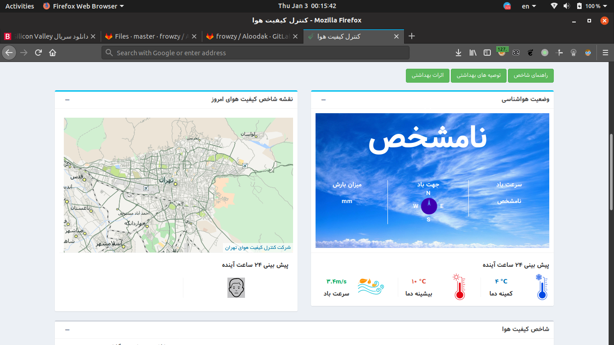

# Aloodak #

it's an assist script for get 'air polution rate' , 'temperature' and 'windspeed' 

for using you have to install dependencies 
by enter this commands in the terminal : 

   ` sudo pip3 install -r requirements.txt

after installation you can use it .. :) 
be happy and enjoy it .. 

 -- note : it just use for my city (Terhran/IRAN) | GMT +3:30 

# Update Note - Site Crash ! #

somtimes site have been crashed and won't show correct values 

** in this case script will show you '?' instead of value because of it doesn't exist **

